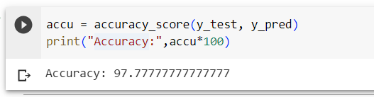

# Implementation of Bayesian-Network

## Aim :
    To create a bayesian Network for the given dataset in Python
## Algorithm:
### Step 1:
Import necessary libraries: pandas, networkx, matplotlib.pyplot, Bbn, Edge, EdgeType, BbnNode, Variable, EvidenceBuilder, InferenceController<br/>
### Step 2:
Set pandas options to display more columns<br/>
### Step 3:
Read in weather data from a CSV file using pandas<br>
### Step 4:
Remove records where the target variable RainTomorrow has missing values<br/>
### Step 5:
Fill in missing values in other columns with the column mean<br/>
### Step 6:
Create bands for variables that will be used in the model (Humidity9amCat, Humidity3pmCat, and WindGustSpeedCat)<br>
### Step 7:
Define a function to calculate probability distributions, which go into the Bayesian Belief Network (BBN)<br/>
### Step 8:
Create BbnNode objects for Humidity9amCat, Humidity3pmCat, WindGustSpeedCat, and RainTomorrow, using the probs() function to calculate their probabilities<br/>
### Step 9:
Create a Bbn object and add the BbnNode objects to it, along with edges between the nodes<br/>
### Step 10:
Convert the BBN to a join tree using the InferenceController<br/>
### Step 11:
Set node positions for the graph<br/>
### Step 12:
Set options for the graph appearance<br/>
### Step 13:
Generate the graph using networkx<br/>
### Step 14:
Update margins and display the graph using matplotlib.pyplot<br/>

## Program:
```
Developed by: Jeeva Abishake A
Register Number: 212221240018
```
```python
import numpy as np
from sklearn.datasets import load_iris
from sklearn.model_selection import train_test_split
from sklearn.naive_bayes import GaussianNB
from sklearn.metrics import accuracy_score

class BayesClassifier:


  def __init__(self):
    self.clf = GaussianNB()


  def fit(self, X, y):
    self.clf.fit(X, y)
   
  def predict(self, X):
    return self.clf.predict(X)


ir = load_iris()


X_train, X_test, y_train, y_test = train_test_split(ir.data, ir.target,test_size=0.3, random_state = 42)


clf = BayesClassifier()

clf.fit(X_train, y_train)

y_pred = clf.predict(X_test)

accu = accuracy_score(y_test, y_pred)
print("Accuracy:",accu*100)


```
## Output:

## Result:
   Thus a Bayesian Network is generated using Python
